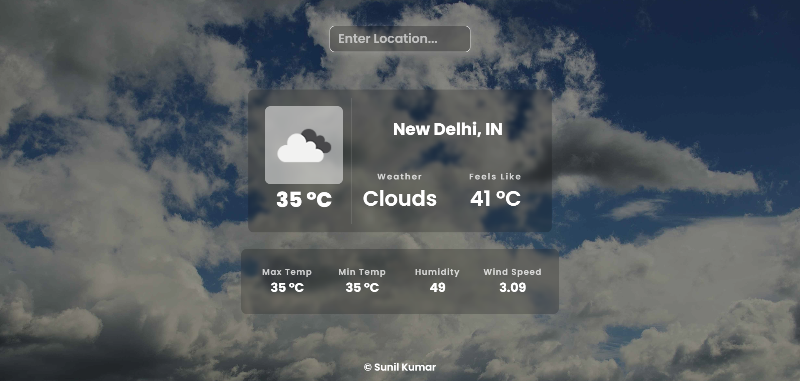
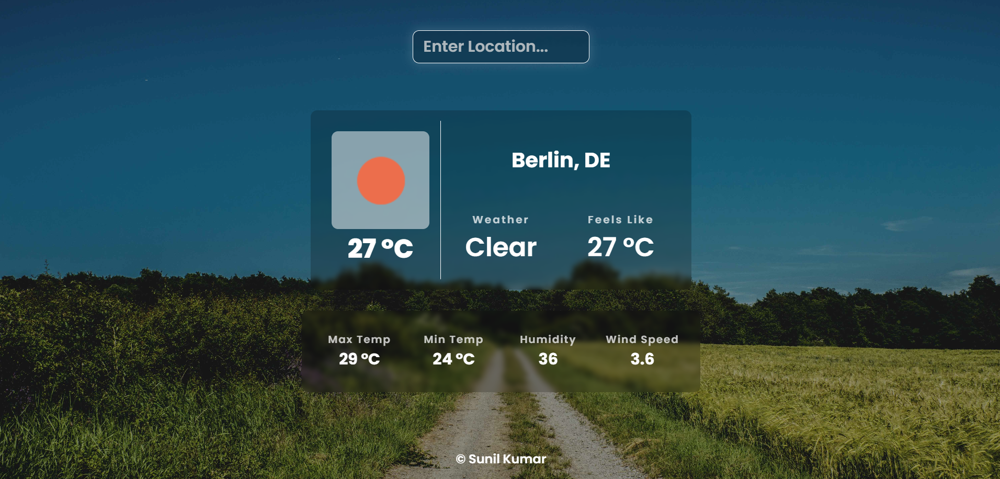
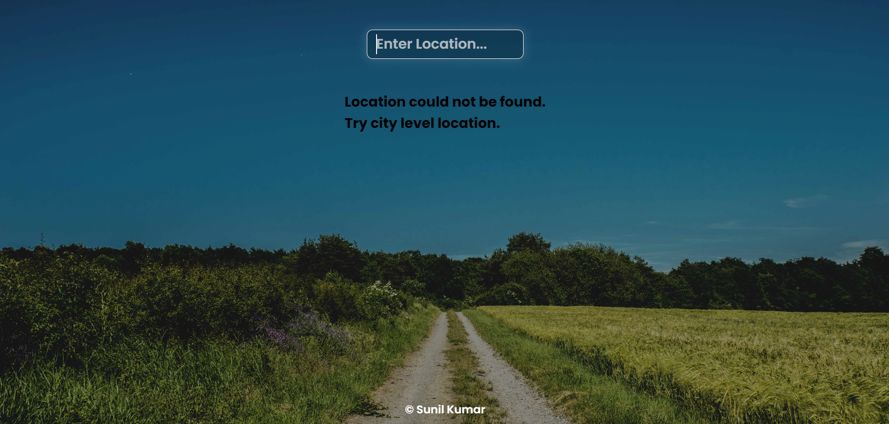
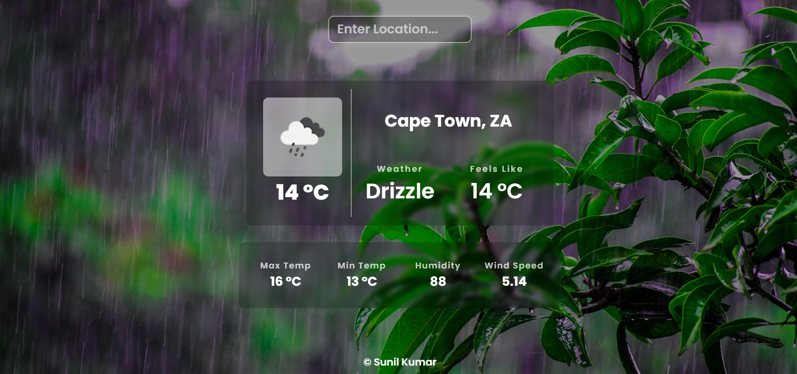

# Weather App using React and Openweathermap API

This is a weather app created using React js and OpenweatherMap.org API.

## Learnings
* Work with API.
* Async, Await, fetch.
* Response error handling.
* DOM Manipulation
* Context API.
* State Management.
* Environment Variables.
* CSS Properties.

## Screenshots

